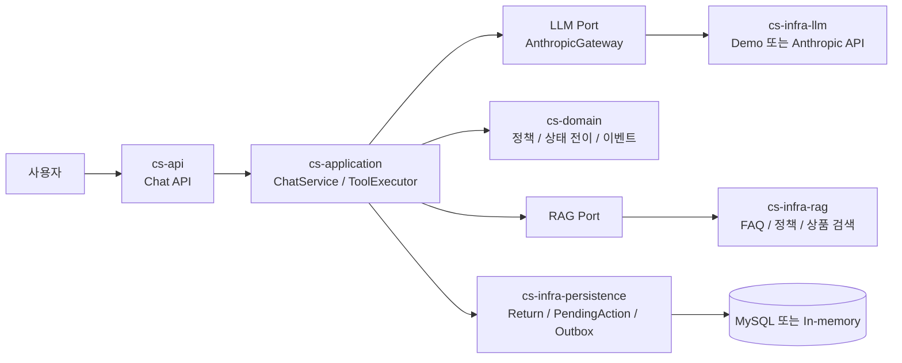
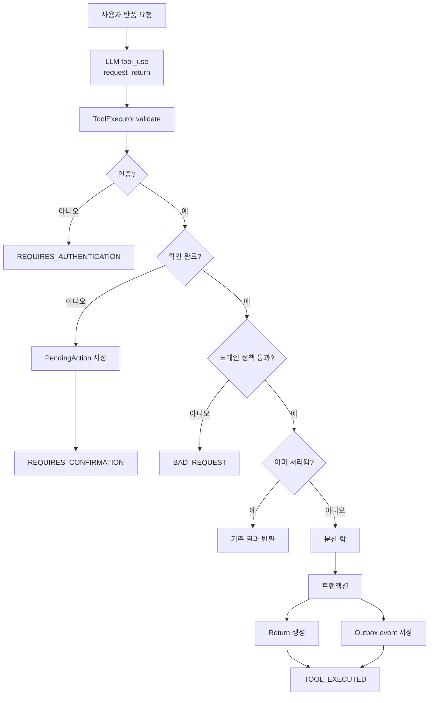
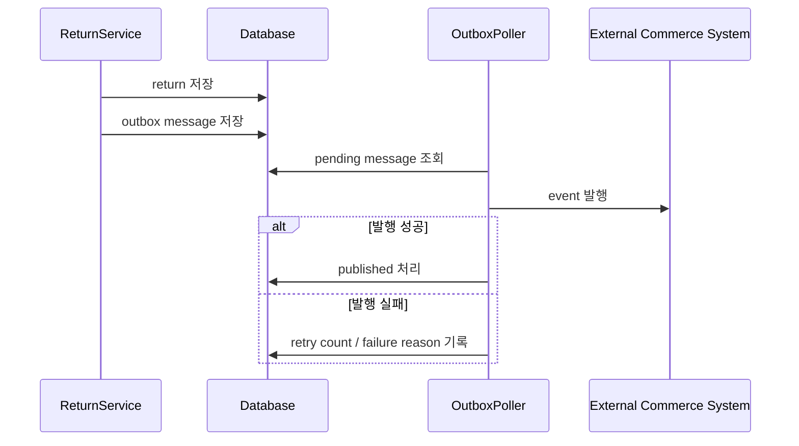
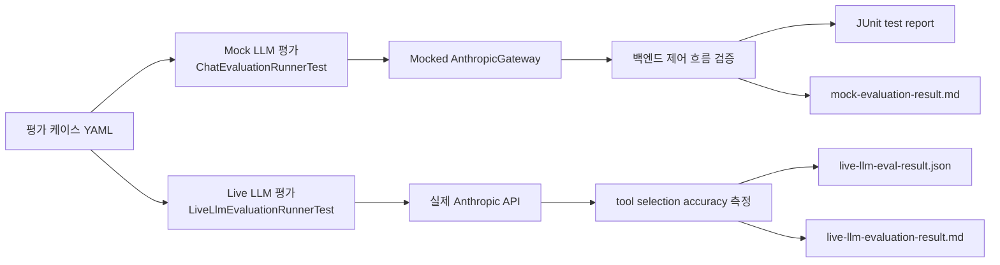

# 시스템 플로우 다이어그램

이 문서는 LLM 기반 고객지원 에이전트의 주요 실행 경계와 평가 흐름을 시각화한다.
결과 수치는 별도 결과 문서에서 관리하고, 이 문서는 설계 의도와 제어 흐름을 빠르게 이해하기 위한 용도다.

## 전체 아키텍처

핵심 경계는 LLM을 실행 주체가 아니라 의도 신호 제공자로 제한하는 것이다.
도구 실행, 인증, 확인, 정책 검증, 멱등성, 트랜잭션 처리는 application과 domain 계층에서 수행한다.

## 변경성 도구 실행 흐름

이 흐름은 LLM이 변경성 도구를 선택하더라도 실제 side effect가 바로 발생하지 않도록 만든다.
사용자 인증, confirmation, 도메인 정책, 멱등성 검증을 통과한 요청만 반품 생성과 outbox 저장까지 진행한다.

## Outbox 발행 흐름

반품 생성 트랜잭션과 외부 시스템 발행을 분리해 장애 전파 범위를 줄인다.
outbox poller는 실패 사유와 재시도 횟수를 남기며, 동시 polling은 lock 경계에서 제어한다.

## 평가 경로 분리

mock 평가는 결정적이고 비용이 없어 일반 회귀 테스트에 적합하다.
live LLM 평가는 API key, 네트워크, 모델 비용, 모델 변경 가능성이 있으므로 별도 Gradle task로 분리한다.

## 문서별 역할

| 문서 | 역할 |
|---|---|
| [architecture.md](architecture.md) | 설계 원칙, 계층 경계, 안전장치 설명 |
| [evaluation.md](evaluation.md) | mock 평가 실행 방법과 해석 기준 |
| [mock-evaluation-result.md](mock-evaluation-result.md) | mocked gateway 기반 결정적 평가 결과 |
| [live-llm-evaluation.md](live-llm-evaluation.md) | 실제 LLM 평가 실행 방법과 환경 변수 |
| [live-llm-evaluation-result.md](live-llm-evaluation-result.md) | 실제 모델 기준 측정 결과 |
